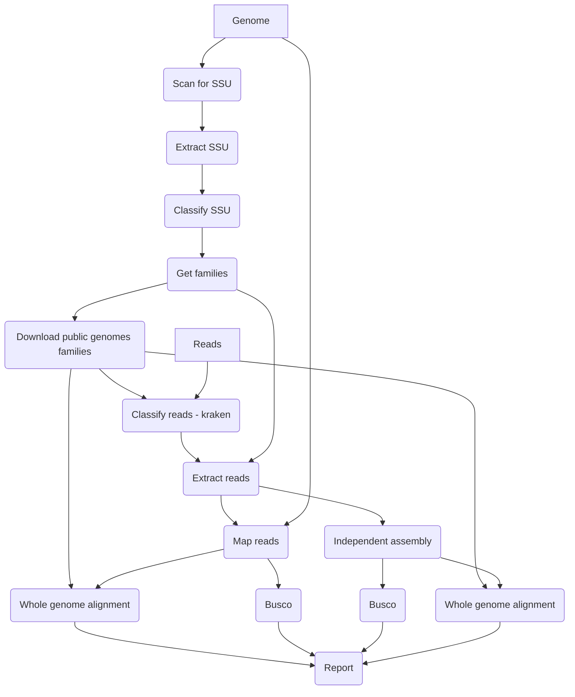

# MarkerScan Pipeline
Pipeline to determine the species composition of your sample, and separate and assemble every component.

1. [Installation](#installation)
2. [Config file](#config-file)
3. [Visual overview of MarkerScan pipeline](#visual-overview-of-markerscan-pipeline)
4. [Workflow details](#workflow-details)

## Installation

### Singularity installation

The prefered way of installation is via the provided singularity container as this will ensure there are no software incompatibilities. 
After installation of singularity, you can pull a docker image of the latest version of the code and convert it into a singularity container:

```
singularity pull docker://emvcaest/markerscan:latest
```

Next you need to bind all required directories of your local machine (see [Config file](#config-file)) to the image

```
export SINGULARITY_BIND="$DIR"
```

The image can now be run as follows:

```
singularity run markerscan_latest.sif snakemake --cores $threads --use-conda --conda-prefix /opt/conda/ -s /MarkerScanPipeline/Snakefile --configfile $configfile
```

### From source

Please clone this directory to your location of choice.

```
git clone https://github.com/CobiontID/MarkerScan.git
```
Download snakemake, e.g. via conda
```
conda install -c bioconda snakemake
```

```
# activate the Conda environment
conda activate snakemake
snakemake --configfile $configfile --cores $threads --use-conda --conda-prefix $condaprefix -s $pipelinedir/Snakefile
```


## Config file

To run the pipeline a yaml file containing all external parameters needs to be created, an example is shown below.

```
reads: zipped fasta read file
genome: unzipped fasta file
shortname: e.g. ilBlaLact1, this will be used in output file names
sci_name: e.g. Blastobasis lacticolella, this name needs to be present in NCBI taxonomy with exact spelling 
workingdirectory: folder to store all output files
datadir: central folder to store output which can be re-used across multiple pipeline runs
full: 0|1 (run only the SSU detection steps, or complete the full pipeline)
```

## Visual overview of MarkerScan pipeline



## Workflow details

1. Run nhmmer with SSU_Prok_Euk_Microsporidia.hmm across the draft assembly
2. Extract coordinates of matches: "{workingdirectory}/{shortname}.ProkSSU.readsinfo"
3. Get SSU locus sequence: "{workingdirectory}/{shortname}.ProkSSU.fa" and collapse by 99% ID using cd-hit: "{workingdirectory}/{shortname}.ProkSSU.reduced.fa"
4. Download SILVA DB if new version available on https://ftp.arb-silva.de/current/ARB_files/ into {datadir}/silva
5. Classify SSU regions using SILVA. Taxonomy per sequence is found in "{workingdirectory}/{shortname}.ProkSSU.reduced.SILVA.tax"
6. Determine the species composition of sample and for which families the procedure continues, output in {workingdirectory}/genera

In the meantime some files are downloaded if necessary:
1. Download all refseq organellar sequences from https://ftp.ncbi.nlm.nih.gov/refseq/release/mitochondrion/ and https://ftp.ncbi.nlm.nih.gov/refseq/release/plastid/ and store in {datadir}/organelles if files not exist or older than 30 days
2. Download all genbank organellar sequences for apicomplexans (common contaminant, but sequence information is rare) via e-utils and store in {datadir}/apicomplexa if files not exist or older than 30 days
3. Download NCBI taxonomy (both names.dmp/nodes.dmp and nucl_wgs.accession2taxid/nucl_gb.accession2taxid) if not latest version. Curl statement will download checksum file from ftp and compare download dates. Database is updated regularly, so downloading is often required.
4. Download genomes for the closest relatives of the target species available. This step is not stored in {datadir} but in {workingdir}, so downloading will be performed for every sample. This step could be optimized if pipeline is going to be run for several closely related species (e.g. moths from same family). Next, this fasta file is split and masked using duskmasker. Outputfile: {workingdirectory}/kraken.relatives.masked.ffn.

The following part of the pipeline will be done very every detected family in the 'metagenomic' composition of the sample.
1. Download all available genomes (refseq if bacterial, all if eukaryotic) for the detected families and store in {datadir}/genera if files not exist or older than 30 days. Copy over to {workingdirectory}/genera. 

As these steps all write their output to a shared directory, running several samples simultaneously could cause problems. Downloading genomes using the NCBI datasets tool could with several queries at once has also proven to be unstable.

This is followed by these steps:
1. All fasta files of the contaminant families are combined, split and masked using duskmasker. Now masking is done every time pipeline is run. This could be optimized if masking was already done when downloading. Result is in {workingdirectory}/kraken.tax.masked.ffn.
2. A kraken database is created using the masked genomes of closely related species target and combined masked fasta file of family members contaminant. {workingdirectory}/krakendb
3. Kraken2 is run. Outputfiles are {workingdirectory}/kraken.output, {workingdirectory}/kraken.report
4. All reads are mapped to the draft assembly. {workingdirectory}/AllReadsGenome.paf

The following part of the pipeline will be done very every detected family in the 'metagenomic' composition of the sample.
1. Reads are extracted per bin. {workingdirectory}/{genus}/kraken.fa
2. Kraken reads are mapped to draft assembly. Fully aligned contigs {workingdirectory}/{genus}/{genus}.ctgs and corresponding reads {workingdirectory}/{genus}/{genus}.reads
3. Run Busco on these contigs. {workingdirectory}/{genus}/busco/busco
4. Run Nucmer {workingdirectory}/genera/{genus}.kraken.tax.ffn on these contigs. {workingdirectory}/{genus}/{genus}\_vs_contigs.overview.txt
5. Combine these results and define certain set of reads to remove. {workingdirectory}/{genus}/{genus}.final_reads.fa --> concatenated across families in **{workingdirectory}/final_reads_removal.fa** and the remaining reads are in **{workingdirectory}/final_reads_target.fa.gz**.

Moreover, also a re-assembly is done.
1. Reads of draft contigs which are not fully aligned are added to the kraken reads
2. Busco is run on the reads {workingdirectory}/{genus}/buscoReads/busco
3. Assembly is done using hifiasm: {workingdirectory}/{genus}/hifiasm/
4. Busco on re-assembled contigs: {workingdirectory}/{genus}/buscoAssembly
5. Nucmer {workingdirectory}/genera/{genus}.kraken.tax.ffn against re-assembled contigs
6. Map reads to re-assembled contigs: {workingdirectory}/{genus}/{genus}.putative_reads.fa --> concatenated across families in **{workingdirectory}/putative_reads_removal.fa**
7. Draw circos plot

Combine all results and generate report file **{workingdirectory}/{shortname}.report.pdf**
This is an example report file: [ilAriAges1.v1.report.pdf](https://github.com/CobiontID/Marker_pipeline/files/6175523/ilAriAges1.v1.report.pdf)
