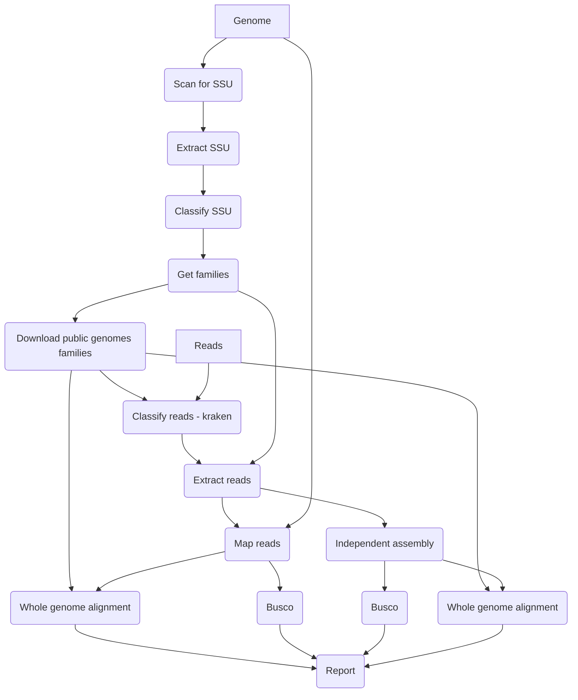

# MarkerScan Pipeline
Pipeline to determine the species composition of your sample, and separate and assemble every component.

1. [Installation](#installation)
2. [Config file](#config-file)
3. [Visual overview of MarkerScan pipeline](#visual-overview-of-markerscan-pipeline)
4. [Workflow details](#workflow-details)

## Installation

### Singularity installation

The prefered way of installation is via the provided singularity container as this will ensure there are no software incompatibilities. 
After installation of singularity, you can pull a docker image of the latest version of the code and convert it into a singularity container:

```
singularity pull docker://emvcaest/markerscan:latest
```

Next you need to bind all required directories of your local machine (see [Config file](#config-file)) to the image

```
export SINGULARITY_BIND="$DIR"
```

The image can now be run as follows:

```
singularity run markerscan_latest.sif snakemake --cores $threads --use-conda --conda-prefix /opt/conda/ -s /MarkerScanPipeline/Snakefile --configfile $configfile
```

### From source

Please clone this directory to your location of choice.

```
git clone https://github.com/CobiontID/MarkerScan.git
```
Download snakemake, e.g. via conda
```
conda install -c bioconda snakemake
```

```
# activate the Conda environment
conda activate snakemake
snakemake --configfile $configfile --cores $threads --use-conda --conda-prefix $condaprefix -s $pipelinedir/Snakefile
```


## Config file

To run the pipeline a yaml file containing all external parameters needs to be created, an example is shown below.

```
reads: zipped fasta read file
genome: unzipped fasta file
shortname: e.g. ilBlaLact1, this will be used in output file names
sci_name: e.g. Blastobasis lacticolella, this full scientific name name needs to be present in NCBI taxonomy with exact spelling 
workingdirectory: folder to store all output files
datadir: central folder to store output which can be re-used across multiple pipeline runs
full: 0|1 (run only the SSU detection steps, or complete the full pipeline)
```

## Visual overview of MarkerScan pipeline



## Workflow details

### Download steps
1. Download SILVA DB (https://ftp.arb-silva.de/current/ARB_files/) into {datadir}/silva (re-run, when new version)
2. Download all refseq organellar sequences from https://ftp.ncbi.nlm.nih.gov/refseq/release/mitochondrion/ and https://ftp.ncbi.nlm.nih.gov/refseq/release/plastid/ and store in {datadir}/organelles (re-run, when older than 180 days)
3. Download all genbank organellar sequences for apicomplexans (common contaminant, but sequence information is rare) via e-utils and store in {datadir}/apicomplexa (re-run, when older than 180 days)
4. Download NCBI taxonomy (both names.dmp / nodes.dmp and nucl_wgs.accession2taxid/nucl_gb.accession2taxid) (re-run, when older than 180 days)

### Workflow steps
1. Run nhmmer with SSU_Prok_Euk_Microsporidia.hmm across the assembly and coordinates of matches can be found in {shortname}.ProkSSU.readsinfo
2. The SSU loci are extracted and collapsed with 99% nucleotide identity and stored in {shortname}.ProkSSU.reduced.fa
3. Classify SSU regions using SILVA. Taxonomy per sequence is found in {shortname}.ProkSSU.reduced.SILVA.tax
4. Determine the species composition of sample and for which families the procedure continues, output in {workingdirectory}/genera
5. Download genomes for the closest relatives of the target species available. Next, this fasta file is split and masked using duskmasker. Outputfile: relatives/kraken.relatives.masked.ffn.
6. Download all available genomes (refseq if bacterial, all if eukaryotic) for the detected families and store in {datadir}/genera (re-run, when older than 180 days).
7. All fasta files of the detected cobiont families are combined in kraken.tax.masked.ffn.
8. A custom kraken database consisting out of kraken.tax.masked.ffn and relatives/kraken.relatives.masked.ffn is created: krakendb/
9. Kraken2 is run. Outputfiles are kraken.output and kraken.report
10. All reads are mapped to the draft assembly: AllReadsGenome.paf


The following part of the pipeline will be done very every detected family based on the composition of the sample.

1. Reads are extracted per bin. {family}/kraken.fa
2. Kraken reads are mapped to draft assembly. Fully aligned contigs {family}/{family}.ctgs
3. Run Busco on these contigs: {family}/busco/
4. Based on the downloaded genomes of this family, homology search using nucmer is performed on these contigs:{family}/{family}\_vs_contigs.overview.txt
5. Combine these results and define certain set of reads which are deemed to belong to this {family}. {family}/{family}.final_reads.fa --> concatenated across families in final_reads_removal.fa and corresponding assembled sequence in final_assembly.fa.

Moreover, also a re-assembly is done.
1. Reads of draft contigs which are not fully aligned are added to the kraken reads: {family}/{family}.reads2assemble.fa
2. Assembly is done using hifiasm: {family}/hifiasm/
3. Busco is run twice, both on the reads as on the novel assembly: {family}/buscoReads and {family}/buscoAssembly
4. Nucmer against re-assembled contigs: {family}/{family}\_vs_hifiasm.overview.txt
5. Map reads to re-assembled contigs: {family}/{family}.putative_reads.fa --> concatenated across families in putative_reads_removal.fa
7. Draw circos plot


Combine all results and generate report file {shortname}.report.pdf and {shortname}.json.
